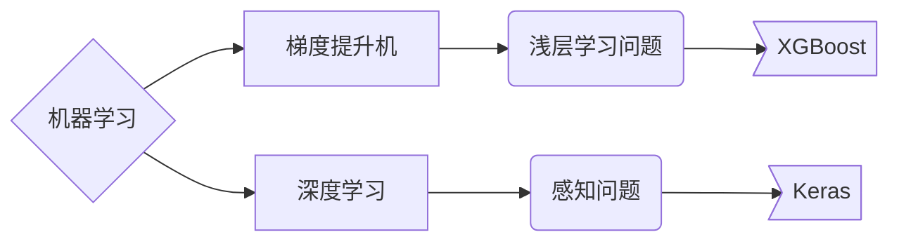
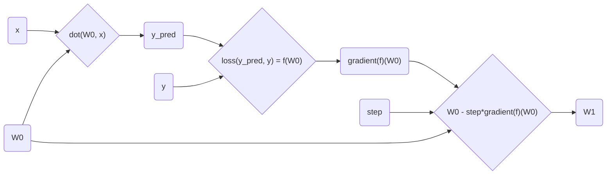
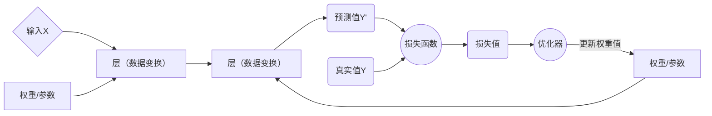
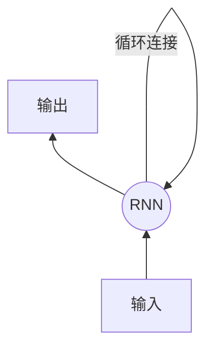
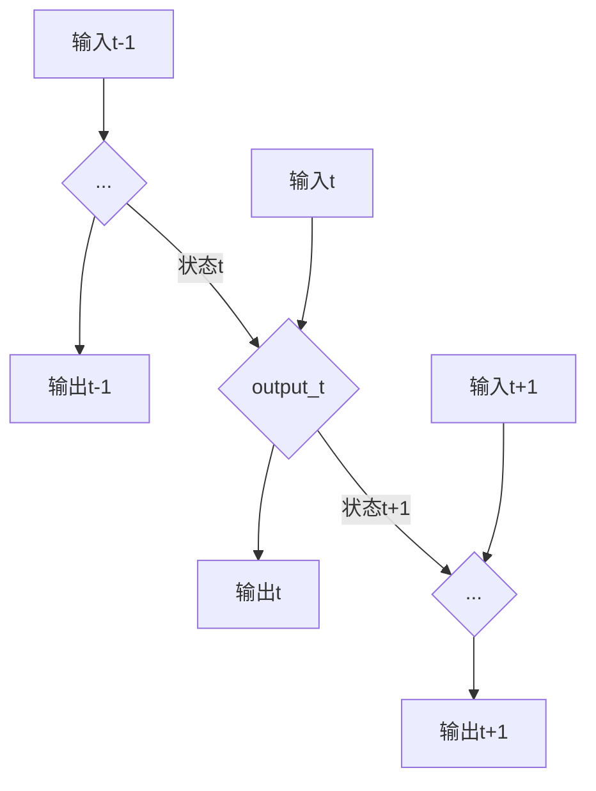
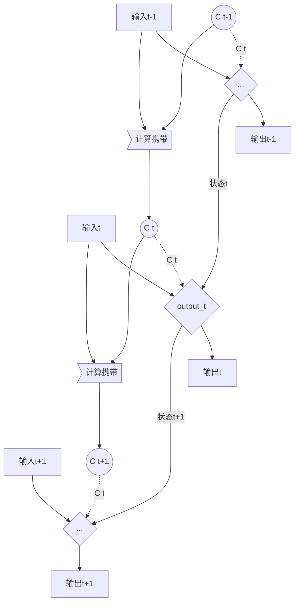
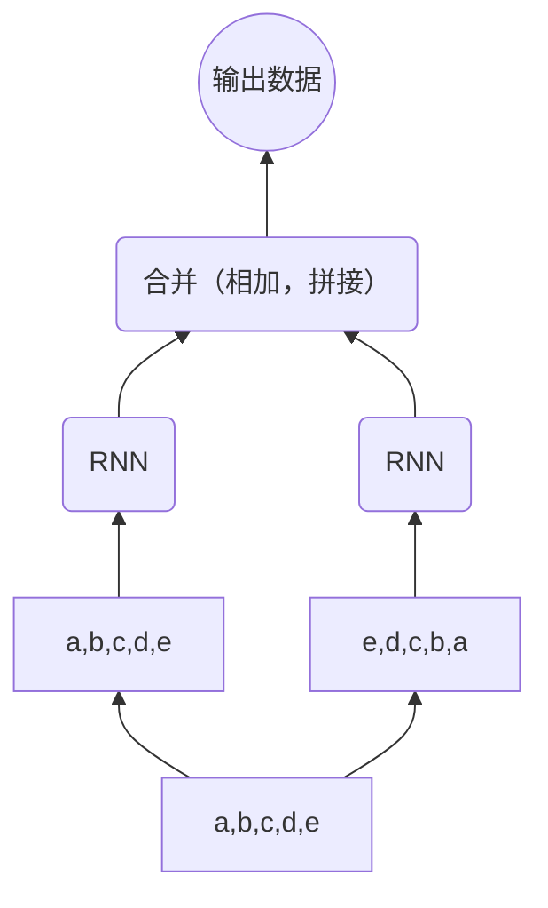
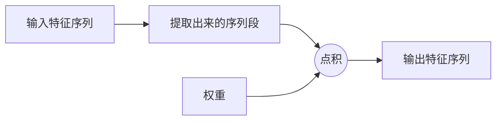
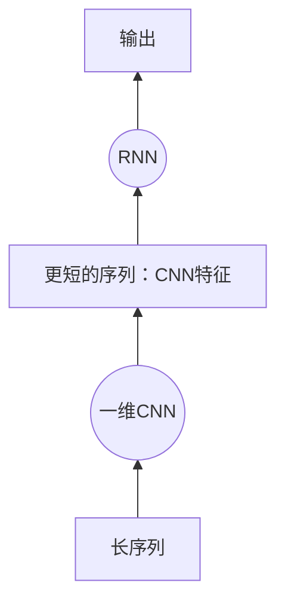

# Python深度学习基础

## 深度学习基础

### 什么是深度学习

#### 人工智能、机器学习与深度学习

人工智能 → 机器学习 →深度学习

- 人工智能

- 机器学习
  - “学习”
  - 假设空间

- 深度学习
  - “深度”
  - 神经网络



#### 深度学习的工作原理

深度学习中的“学习”：为神经网络的所有层找到一组权重值，使得该网络能够将每个示例输入与其目标正确地一一对应

训练目标：找到权重的正确取值

核心算法：反向传播（优化器发出反馈信号调节权重值）

#### 深度学习的基本特征

1. 通过渐进的、逐层的方式形成越来越复杂的表示
2. 对中间这些渐进的表示共同进行学习，每一层的变化都需要同时考虑上下两层的需要

### 神经网络的数学原理

- 神经网络
  - 层
  - 编译步骤
    - 损失函数
    - 优化器
      - SGD
      - 带动量的SGD
      - Adagrad
      - RMSProp
      - 其他
    - 监控指标

#### 张量

轴：张量的维度

- 数据张量的第一个轴（0轴）
  - 整个数据集 → 样本轴/样本维度
  - 数据集拆分得到的批量 → 批量轴/批量维度

- 示例
  - 标量：0D张量
  - 向量：1D张量
    - 一个含有5个元素的向量 → 5***D向***量/5***阶张***量
  - 矩阵：2D张量

##### 张量的关键属性

1. 轴的个数（阶）→ `ndim`
2. 形状
3. 数据类型 → `dtype`

##### 张量切片

##### 现实数据中的张量

- 向量数据：2D张量

  `(samples, features)`

- （时间）序列数据：3D张量

  `(samples, timesteps, features)`

- 图像：4D张量

  `(samples, height, width, color_depth)`

- 视频：5D张量

  `(samples, frames, height, width, color_depth)`

#### 张量运算

- 逐元素运算

  e.g. `+, -, *, relu()`

- 广播

  1. 添加广播轴
  2. 沿着广播轴重复较小的张量

- 张量点积

  `dot(x,y)`

- 张量变形

#### 基于梯度的优化

随机初始化

训练循环：

1. 抽取训练样本`x`和对应目标`y`组成的数据批量
2. 在`x`上运行网络（即“前向传播”），得到预测值`y_pred`
3. 计算网络在这批数据上的损失，用于衡量`y_pred`与`y`之间的距离
4. 计算损失相对于网络系数的梯度（即一次“反向传播”）
5. 将参数沿着梯度的反方向移动一点，比如`W -= step * gradient`，从而使这批数据上的损失减小一点
   - `step`因子需要选取合适的值

##### 梯度

```pseudocode
y_pred = dot(W0,x)
loss_value = loss(y_pred, y) = f(W0)
gradient(f)(W0)   # gradient at W0
```



- SGD算法
  - 真SGD算法 → 每次迭代只抽取一个样本和目标
  - 小批量SGD算法 →  每次迭代抽取一批样本和目标
  - 批量SGD算法 →  每次迭代在所有数据上运行


### 神经网络剖析

#### 神经网络的核心组件



##### 层

神经网络的基本数据结构

分类：

- 2D张量 → 密集连接层（又叫全连接层或密集层）

  `Dense`

- 3D张量 →循环层

  `LSTM`

- 4D张量 → 二维卷积层

  `Conv2D`

层兼容性：每一层只接受特定形状的输入张量，并返回特定形状的输出张量

深层学习模型是层构成的<u>有向无环图</u> → e.g.线性堆叠、双分支网络、多头网络、Inception模块等

→ 网络拓扑结构

网络拓扑结构定义了一个假设空间

##### 输入数据和相应的目标

##### 损失函数/目标函数

梯度下降过程必须基于**单个**标量损失值

→ 对于具有多个损失函数的网络，需要将所有损失函数取平均

目的：使损失尽可能最小化

损失函数选择：

- 二分类问题 → 二元交叉熵
- 多分类问题 → 多元交叉熵
- 回归问题 → 均方误差
- 序列学习问题 →联结主义时序分类

##### 优化器

#### Keras开发概述

1. 定义训练数据：输入张量和目标张量
2. 定义层组成的网络（或模型），将输入映射到目标
   - 两种方法
     1. 使用`Sequential`类 → 仅用于层的线性堆叠
     2. 使用函数式API → 用于层组成的有向无环图，可以建立任何形式的架构
   - 关键架构
     1. 网络有多少层
     2. 每层有多少个隐藏单元
   - 激活函数
3. 配置学习过程：选择损失函数、优化器和需要监控的指标
4. 调用模型的`fit`方法在训练数据上进行迭代

### 代码实例

```python
# 加载数据集
from keras.dataset import mnist
(train_images, train_labels), (test_images, test_labels) = mnist.load_data()

# 搭建网络架构
from keras import models
from keras import layers
network = models.Sequential()
network.add(layers.Dense(512, activation='relu', input_shape=(28*28,)))   # 有512个输出单元，input_shape为输入形状参数，activation为激活函数
network.add(layers.Dropout(0.5))   # 将dropout应用于前一层的输出，系数为0.5
network.add(layers.Dense(10, activation='softmax'))
# 该模型为Sequential类，包含两个Dense层（全连接层）

# 编译
network.compile(optimizer='rmsprop', 
                loss='categorical_crossentrophy', 
                metrics=['accuracy'])
# optimizer: 优化器；loss: 损失函数；metrics: 指标

# 准备图像数据
train_images = train_images.reshape((60000, 28*28))
train_images = train_images.astype('float32') / 255
test_images = test_images.reshape((10000, 28*28))
test_images = test_images.astype('float32') / 255

# 准备标签
from keras.utils import to_categorical
train_labels = to_categorical(train_labels)
test_labels = to_categorical(test_labels)

# 留出验证集
val_images = train_images[:1000]
partial_train_images = train_images[1000:]
val_labels = train_labels[:1000]
partial_train_labels = train_labels[1000:]

# 训练网络
network.fit(partial_train_images, partial_train_labels, 
            epochs=5, batch_size=128, validation_data=(val_images,val_labels))

# 评估模型
test_loss, test_acc = network.evaluate(test_images, test_labels)
```

### 机器学习基础

#### 机器学习的四个分支

1. 监督学习 → 分类&回归术语表
   - 分类
   - 回归
   - 序列生成
   - 语法树预测
   - 目标检测
   - 图像分割
2. 无监督学习
   - 降维
   - 聚类
3. 自监督学习
   - 自编码器
4. 强化学习

监督学习、无监督学习和自监督学习之间没有非常明确的界限

#### 评估机器学习模型

评估模型的重点是将数据划分为三个集合：<u>训练集、验证集和测试集</u>

信息泄露

评估方法：

1. 简单的留出验证

   适用于可用数据较多的情况

2. K折验证

   适用于可用数据较少的情况

3. 带有打乱数据的重复K折验证

   适用于可用数据较少且对精度要求较高的情况，计算代价较大

评估的注意事项：

1. 数据代表性：划分数据集之前应随机打乱数据
2. 时间箭头：测试集中所有数据的时间都必须晚于训练集数据
3. 数据冗余：训练集和测试集之间不能有交集

#### 数据预处理、特征工程和特征学习

##### 数据预处理

1. 向量化

   将数据转化为张量形式

2. 值标准化

   - 输入数据应有的特征
     - 取值较小
     - 同质性
   - 标准化方法（非必需）
     - 平均值 = 0
     - 标准差 = 1

3. 处理缺失值

##### 特征工程

手动进行硬编码的变换

#### 过拟合与欠拟合

优化 vs. 泛化

降低过拟合的方法：获取更多的训练数据或进行<u>正则化</u>

常见正则化方法：

1. 减小网络大小

2. 添加权重正则化

   - 成本的两种形式
     1. L1正则化
     2. L2正则化/权重衰减

3. 添加dropout正则化

   随机舍弃层的一些输出特征 → dropout比率

#### 机器学习的通用工作流程

1. 定义问题，收集数据集

   - 输入数据是什么？要预测什么？

   → 不能解决<u>非平稳问题</u>

2. 选择衡量成功的指标

   - 平衡分类问题
     - 精度
     - 接收者操作特征曲线下面积（ROC AUC）
   - 非平衡分类问题
     - 准确率
     - 召回率
   - 排序问题或多标签分类
     - 平均准确率均值
   - 自定义指标

3. 确定评估方法

   - 留出验证集
   - K折交叉验证
   - 重复的K折验证

4. 准备数据

   - 将数据格式化为张量
   - 将张量的取值缩放为较小的值
   - 异质数据标准化
   - 特征工程

5. 开发比基准更好的模型

   - 目标：获得统计功效

   - 关键参数

     - 最后一层的激活函数
     - 损失函数
     - 优化配置

     |      问题类型       | 最后一层激活 |           损失函数            |             优化配置              |
     | :-----------------: | :----------: | :---------------------------: | :-------------------------------: |
     |     二分类问题      |  `sigmoid`   |    `binary_crossentrophy`     | 一般可使用`rmsprop`及其默认学习率 |
     | 多分类、单标签问题  |  `softmax`   |  `categorical_crossentrophy`  | 一般可使用`rmsprop`及其默认学习率 |
     | 多分类、多标签问题  |  `sigmoid`   |    `binary_crossentrpohy`     | 一般可使用`rmsprop`及其默认学习率 |
     |    回归到任意值     |      无      |             `mse`             | 一般可使用`rmsprop`及其默认学习率 |
     | 回归到0~1范围内的值 |  `sigmoid`   | `mse`或`binary_crossentrophy` | 一般可使用`rmsprop`及其默认学习率 |

     

   > **`sigmoid` vs. `softmax`**
   >
   > - 在最后进行分类时，若各个类别之间是互斥的，且规定每一样本只能属于其中一个类别（多分类、单标签），那么应当使用`softmax`函数，选择<u>其中可能性最大的一个</u>标签
   > - 若只有一个类别（二分类、logistic回归）或样本能同时属于多个类别（多分类、多标签），那么应当使用`sigmoid`函数，针对<u>每一个类别</u>*分别*作出是/否属于该类别的判断，最后将各类别的结果合并起来，得到样本所有的标签

6. 扩大模型规模：开发过拟合的模型

   - 添加更多的层
   - 让每一层变得更大
   - 训练更多的轮次

7. 模型正则化与调节超参数

   不断地调节模型、训练、在验证数据上评估、再次调节模型，重复这一过程直到模型达到最佳性能。

   - 尝试：
     - 添加dropout
     - 尝试不同的架构：添加或减少层数
     - 添加L1和/或L2正则化
     - 尝试不同的超参数
     - （可选）反复做特征工程：添加新特征或删除没有信息量的特征

   > **参数 vs. 非参数**
   >
   > - 参数：由数据得到，如神经网络中的权重
   > - 超参数：模型外部的配置，由人工指定，无法从数据中估计得到

---

## 深度学习用于文本和序列

处理序列的两种基本深度学习算法：

- 循环神经网络（RNN）
- 一维卷积神经网络

算法应用：

- 文档分类和时间序列分类
- 时间序列对比
- 序列到序列的学习
- 情感分析
- 时间序列预测

### 处理文本数据

文本向量化：将文本转化为数值张量

- 实现方法
  - 将文本分割为<u>单词</u>，并将每个单词转换为一个向量
  - 将文本分割为<u>字符</u>，并将每个字符转换为一个向量
  - 提取单词或字符的<u>n-gram</u>，并将每个n-gram转换为一个向量
    - n-gram：从一个句子中提取的n个（或更少）连续单词或字符的集合（n-gram之间可重叠）
    - 得到的集合被称作“n元语法袋”，“袋”指的是标记没有特定的顺序
    - n-gram一般只用于浅层文本处理，深层学习多用分层特征学习的方式

标记（token）：文本分解而成的单元——单词、字符或n-gram

分词（tokenization）：将文本分解成标记的过程

将数值向量与应用分词方案得到的标记相关联的主要方法：

1. one-hot编码 → 稀疏、高维、硬编码

   - 将每个单词与一个唯一的整数索引相关联，然后将这个整数索引$i$转换为长度为$N$的二进制向量（$N$是词表大小），这个向量只有第$i$个元素是1，其余元素都是0
   - 变体：<u>one-hot散列技巧</u>（one-hot hashing trick）
     - 将单词散列编码为固定长度的向量，通常用一个非常简单的散列函数来实现
     - 散列空间的维度需要远大于散列的唯一标记的个数以避免散列冲突

2. 标记嵌入（通常只用于单词，叫作词嵌入） → 密集、低维、从数据中学习得到

   - 获取方法

     1. 在完成主任务的同时学习嵌入

        一个好的词嵌入空间在很大程度上取决于具体任务，因此合理的做法是对每个新任务都学习一个新的嵌入空间

        → 在Keras中就是学习一个`Embedding`层的权重

        ```mermaid
        graph LR;
        a[单词索引] --> b((Embedding层))
        b --> c[对应的词向量]
        ```

        - 输入：一个二维整数张量，形状为`(samples, sequence_length)`，每个元素是一个整数序列

          较短的序列用0填充，较长的序列进行截断

        - 输出：一个三维浮点数张量，形状为`(samples, sequence_length, embedding_dimensionality)`

     2. 预训练词嵌入：在不同于待解决问题的机器学习任务上预计算好词嵌入，然后将其加载到模型中

        适用于可用的训练数据较少但所需特征又比较通用的情况

        常见的预计算词嵌入数据库：word2vec, GloVe

---

### 循环神经网络

循环神经网络处理序列的方式：遍历所有序列元素并保存一个状态，其中包含与已查看内容相关的信息

→ 一类具有内部环的神经网络

→ 网络内部会对序列元素进行遍历



需要设置初始状态

RNN伪代码：

```pseudocode
state_t = 0
for input_t in input_sequence:
		output_t = activation(dot(W, input_t) + dot(U, state_t) + b) 
		state_t = output_t
```



#### `SimpleRNN`层

`SimpleRNN`层：

- 输入：`(batch_size, timesteps, input_features)`
- 输出：
  - `return_sequences = False`: 只返回最每个输入序列的最终输出，输出张量的形状为`(batch_size, output_features)`
  - `return_sequences = True:` 返回每个时间步连续输出的完整序列，输出张量的形状为`(batch_size, timesteps, output_features)`

`SimpleRNN`过于简化，不擅长处理长序列，比如文本。

原因：梯度消失问题

→ 随着层数的增加，网络最终变得无法训练。

#### `LSTM`层和`GRU`层

##### `LSTM`

`LSTM`的原理：算法会保存信息以便后续使用，从而防止较早期的信号在处理过程中逐渐消失。

→ “传送带”原理

**携带数据流**：携带跨越时间步的信息，是一种调节下一个输出和下一个状态的方法。

携带数据流将与输入连接和循环连接进行运算，从而影响传递到下一个时间步的状态。



```pseudocode
output_t = activation(dot(state_t, Uo) + dot(input_t, Wo) + dot(C_t, Vo) + bo)

i_t = activation(dot(state_t, Ui) + dot(input_t, Wi) + bi)
f_t = activation(dot(state_t, Uf) + dot(input_t, Wf) + bf)
k_t = activation(dot(state_t, Uk) + dot(input_t, Wk) + bk)

c_t+1 = i_t * k_t + c_t * f_t
```

LSTM的优势在于处理更复杂的自然语言问题，特别是问答和机器翻译。

##### `GRU`

`GRU`（门控循环单元）层的工作原理与`LSTM`相同，但做了一些简化，使得运行的计算代价更低而表示能力不如`LSTM`。

更善于记住最近的数据，而不是久远的数据。

### 循环神经网络的高级用法

- 循环dropout：在循环层中使用dropout来降低过拟合
- 堆叠循环层
- 双向循环层：将相同的信息以不同的方式呈现给循环网络，可以提高精度并缓解遗忘问题

#### 循环dropout

在循环网络中使用dropout的方法：

- 对每个时间步使用<u>相同</u>的dropout掩码（即相同模式的舍弃单元）
- 为了对`GRU`、`LSTM`等循环层得到的表示做正则化，应该将不随时间变化的dropout掩码应用于层的内部循环激活（叫作循环dropout掩码）

对每个时间步使用相同的dropout掩码可以让网络沿着时间正确地传播其学习误差，而随着时间变化的dropout掩码则会破坏这个误差信号，并且不利于学习过程。

Keras每个循环层中与dropout有关的参数：

- `dropout`: 一个浮点数，指定该层输入单元的dropout比率
- `recurrent_dropout`: 指定循环单元的dropout比率

#### 双向循环层

双向RNN利用了RNN的顺序敏感性：包含两个普通RNN，每个人RNN分别沿一个方向输入序列进行处理（时间正序和时间逆序），然后将它们的表示合并在一起。

双向RNN能够捕捉到可能被单向RNN忽略的模式。

双向RNN很适合用于自然语言处理任务。

双向RNN层的工作原理：



在Keras中通过`Bidirectional`层来实现双向RNN。

### 用卷积神经网络处理序列

对于文本分类和时间序列预测等简单任务，小型的一维卷积神经网络可以替代RNN，而且速度更快、计算代价更低。

一维卷积神经网络对于时间平移而言具有平移不变性。

一维卷积神经网络对于大于卷积窗口大小的尺度的时间步的顺序不敏感。

字符级的一维卷积神经网络能够学会单词构词法。



#### 一维池化

**池化（Pooling）：**从输入中提取一维序列段（即子序列），然后输出其最大值（**最大池化**）或平均值（**平均池化**）。

→ 用于降低一维输入的长度（子采样）

#### Keras中的一维卷积神经网络实现

`Conv1D`层：

- 输入：形状为`(samples, time, features)`的三维张量
- 输出：与输入形状类似的三维张量
- 卷积窗口：时间轴（第2个轴）上的一维窗口

池化层：

- 一维最大池化：`MaxPooling1D`
- 一维平均池化：`AveragePooling1D`

##### 一维卷积神经网络的架构

1. 预处理层（如`Embedding`）
2. `Conv1D`层和池化层（如`MaxPooling1D`层）的堆叠
3. 全局池化层（如`GlobalMaxPooling1D`层）或`Flatten`层 → 将三维输出转换为二维输出
4. 输出处理层（如`Dense`层） → 进行分类或回归等任务

#### 结合RNN和CNN来处理长序列

方法：在RNN前面使用一维卷积神经网络作为预处理步骤，将RNN无法处理的长输入序列转换为高级特征组成的更短序列（下采样），然后提取特征组成的这些序列成为网络中的RNN的输入。



- 如果序列数据的**整体顺序很重要**，那么最好使用**RNN**来处理
- 如果整体顺序**没有意义**，那么**一维卷积神经网络**可以实现同样好的效果，而且计算代价更小


